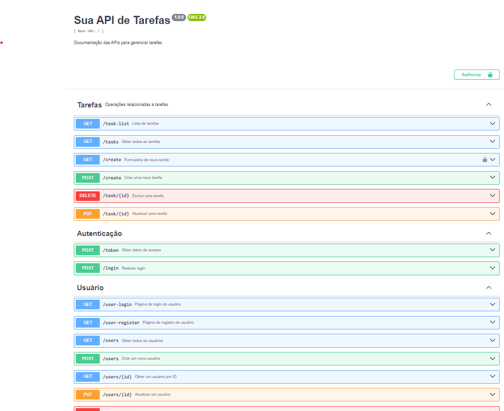

# Implementação de uma API

Bem-vindos à documentação da API da nossa atividade ponderada! Esta documentação foi criada para fornecer uma visão geral e instruções detalhadas sobre como utilizar e contribuir para a API que estamos desenvolvendo como parte deste projeto.

## Visão Geral
Nossa atividade ponderada envolve a construção de uma API síncrona, com o objetivo principal de permitir que os usuários realizem operações CRUD (Create, Read, Update, Delete) em tarefas. A API é um componente fundamental do projeto e deve ter um grau de maturidade 2, incluindo recursos de autenticação de usuário.


## Entregáveis

#### Collections do Insomnia: 
[Link Insomnia] (https://github.com/gabInteli/M10-Inteli-Eng-Comp_Gabriela_Matias/blob/main/src/ponderada1/src/insomnia.json)
#### YAML do OpenAPI (Swagger): 
[Link Swagger](https://github.com/gabInteli/M10-Inteli-Eng-Comp_Gabriela_Matias/blob/main/src/ponderada1/src/swagger.yaml)
#### Código Fonte da API: 
[Link API](https://github.com/gabInteli/M10-Inteli-Eng-Comp_Gabriela_Matias/blob/main/src/ponderada1/src/src/main.py)
#### Instruções de Execução da API: Esse você encontra aqui ! 🫡


### Repositório de Resolução do Projeto

[✔] [Ponderada 1](https://github.com/gabInteli/M10-Inteli-Eng-Comp_Gabriela_Matias/tree/main/src/ponderada1)

## Requisitos - Instalando Dependências 

1. Primeiro passo é Clonar o Repositório base: 
```
git clone https://github.com/gabInteli/M10-Inteli-Eng-Comp_Gabriela_Matias.git
```
em seguida acessar a pasta: 
```
cd src/ponderada1/src
```

2. Logo após criar a sua venv e ativa-la (vide as Instuções na Seguinte Documentação: [Instruções de venv com Python](https://murilo-zc.github.io/M10-Inteli-Eng-Comp/Encontros/encontro_01/nivel2))

3. Instalando as Dependências: 
```
python -m pip install -r requirements.txt
```

##  Modo de Execução da API

1. Criação do Database 
Inicialmente temos uma modelagem de banco de dados estruturada pelas tabelas: Users e Tasks. Para gerar o db basta rodar o comando: 
```
python src/main.py create_db
```

2. Iniciando as APIs 
Para iniciarmos o nosso servidor em Flask vamos rodar: 
```
python -m flask --app src.main run
```

3. Acessando as Rotas 
Aqui podemos acessar nossas rotas com: http://localhost:5000/

### Autenticação - Níveis 
Para criar uma API com niveis de seguraça, temos rotas que necessitam de autenticação para o acesso e rotas que não necessitam: 

#### Rotas sem Autenticação: 
- "/"
- "/user-register"
- "/user-login

#### Rotas com Autenticação: 
Todas as demais rotas tem o JWT como um parâmetro de acesso. 

### Swagger 
Foi desenvolvido um arquivo swagger para facilitar os testes e melhorar a documentação de toda API desenvolvida. 


### Demonstração de Funcionamento com Interface

A demonstração pode ser verificada no vídeo abaixo:  
<iframe width="560" height="400" src="https://www.youtube.com/embed/pzalapsCr7k?si=BOj28WBp0yeTOA5d" title="YouTube video player" frameborder="0" allow="accelerometer; autoplay; clipboard-write; encrypted-media; gyroscope; picture-in-picture; web-share" referrerpolicy="strict-origin-when-cross-origin" allowfullscreen></iframe>

### Demonstração de Funcionamento com Insomnia: 

A demonstração pode ser verificada no vídeo abaixo:  
<iframe width="560" height="315" src="https://www.youtube.com/embed/3p2nFk-DDDA?si=QOIDEhcFW2gcVPbM" title="YouTube video player" frameborder="0" allow="accelerometer; autoplay; clipboard-write; encrypted-media; gyroscope; picture-in-picture; web-share" referrerpolicy="strict-origin-when-cross-origin" allowfullscreen></iframe>